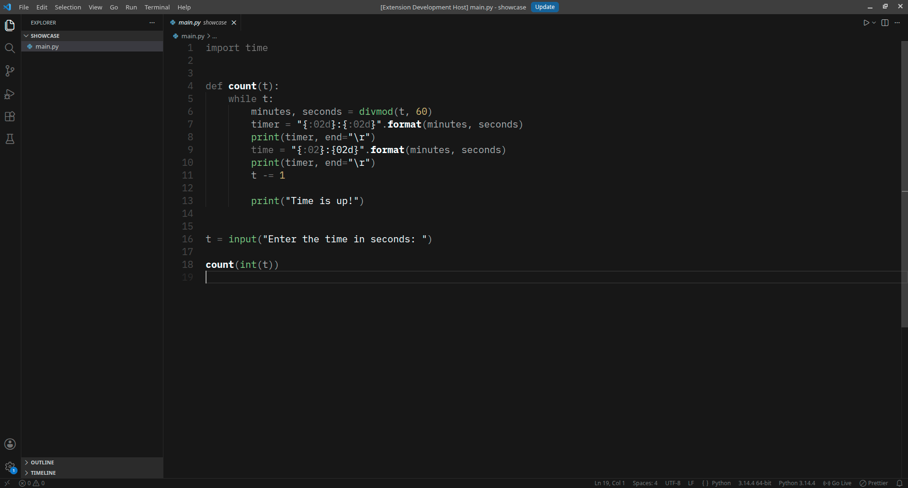

# Minimal Code Theme

A Minimal Visual Studio Code Theme inspired by [Koda](https://github.com/oskarnurm/koda.nvim) and [Monochrome](https://github.com/anotherglitchinthematrix/monochrome.git).

### IMPORTANT

Put this on your settings.json `"editor.bracketPairColorization.enabled": false,`

VsCode won't let me change this so make sure you use this setting.

